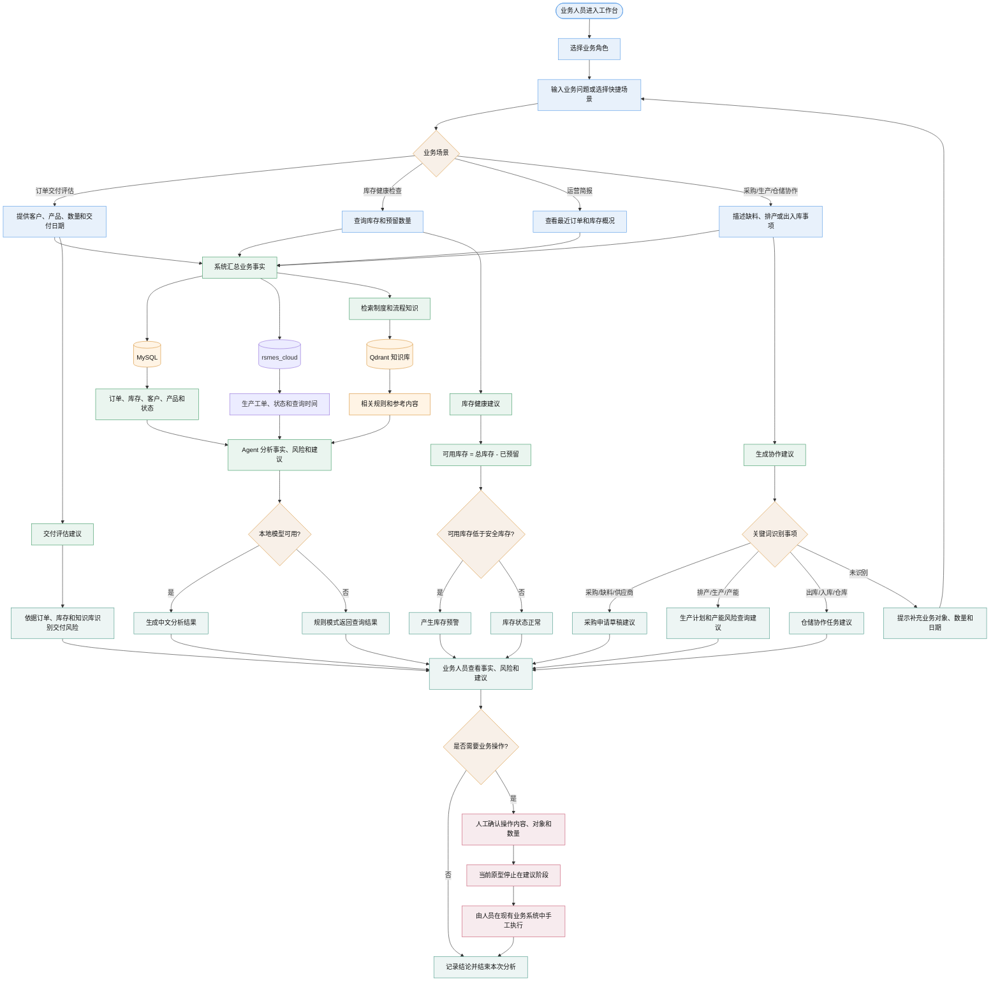

# 业务流程图

本文档从业务人员视角描述当前 FlowPilot 原型如何处理订单、库存、采购、生产和仓储协作。流程以当前已实现代码为准，AI 输出的是分析结果和建议，不会自动执行写操作。

## 业务协作总流程

## 各场景说明

- 订单交付评估：系统读取最近订单和相关库存，把业务上下文交给 Agent，输出交付事实、风险和建议。当前没有独立的生产计划、BOM 或产能计算服务。
- 库存健康检查：工作台根据 `总库存 - 已预留库存` 计算可用库存，并用产品安全库存判断预警；Agent 对话则根据关键词读取库存并生成建议。
- 运营简报：读取最近 20 条订单和库存概况，由 Agent 总结需要销售、生产和仓储关注的事项。
- 采购协作：命中“采购、缺料、供应商”等关键词时，返回“生成采购申请草稿”的建议，不会保存采购单。
- 生产协作：命中“排产、生产、产能”等关键词时，会读取 `rsmes_cloud.mes_product_workorder` 的工单概览和最近工单；排产计算和写回仍未实现。
- 仓储协作：命中“出库、入库、仓库”等关键词时，返回仓储协作任务建议，不会自动执行出入库。

## 当前业务闭环边界

当前闭环是“提出问题 -> 汇总事实 -> AI 分析 -> 人工确认 -> 人工执行”，不是自动化交易闭环。正式业务流程还需要补充权限校验、审批状态、采购单和生产计划等业务对象，以及操作审计和幂等控制。
