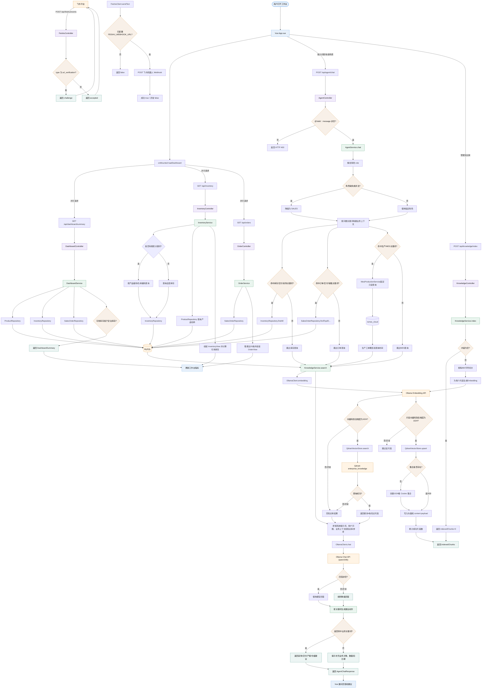

# 当前项目流程图

本文档按当前源码绘制 FlowPilot 原型的运行流程，包含工作台加载、Agent 对话、知识库索引和飞书事件四条链路。

## 总体流程

## 关键边界

- 当前 Agent 读取 AgentProject MySQL、按需读取 rsmes_cloud 和 Qdrant 数据，并生成建议，不会自动创建采购单、修改订单或执行出入库。
- Ollama Chat 不可用时，`AgentService` 使用 `rule-fallback` 返回规则模式结果。
- 知识库检索失败时使用空参考内容，不会阻断 Agent 对话。
- 角色目前影响提示词和响应字段，还没有实现真正的数据权限过滤；MES只读接入也未做用户级数据范围控制。
- 飞书事件接口当前只处理 URL 验证并接受其他事件，不会调用 `AgentService`。
- `FeishuClient.sendText` 是独立 Webhook 适配器，目前没有接入 Agent 主流程。
